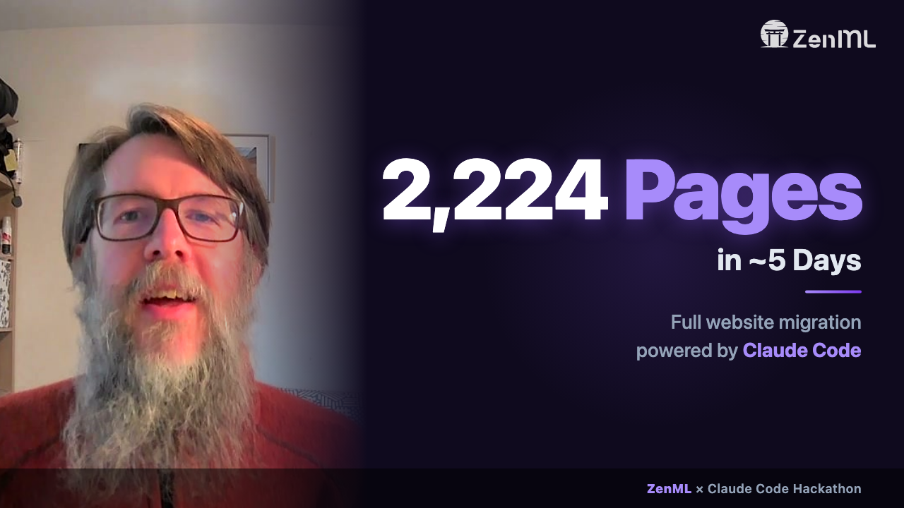

# ZenML Website v2

[](https://github.com/zenml-io/zenml-io-v2/actions/workflows/deploy.yml)
[](https://astro.build/)
[](https://tailwindcss.com/)
[](https://preactjs.com/)
[](https://pages.cloudflare.com/)
[](https://www.typescriptlang.org/)

<div align="center">

[](https://youtu.be/vd70OvKFbVc)

**[Watch the 3-minute demo](https://youtu.be/vd70OvKFbVc)** | **[Browse the live site](https://zenml-io-v2.pages.dev/)**

</div>

> **Built during the [Claude Code Hackathon](https://cerebralvalley.ai/e/claude-code-hackathon) (Feb 10–16, 2026).** One person migrated ZenML's entire production website — 2,224 pages across 20 CMS collections — from Webflow to a self-hosted Astro site in ~5 days using Claude Code with Opus 4.6. The demo video above was also built programmatically with Remotion using Claude Code.

The next-generation [zenml.io](https://www.zenml.io) website — migrated from Webflow to a self-hosted static site for full control over content, design, and performance.

## Tech Stack

| Layer | Technology |
|-------|-----------|
| Framework | [Astro](https://astro.build/) v5 (TypeScript, static-first, content collections) |
| Content | Markdown (`.md`) files in git with [Zod](https://zod.dev/)-validated schemas |
| Styling | [Tailwind CSS](https://tailwindcss.com/) v4 (utility-first, `@theme` design tokens) |
| Interactive | [Preact](https://preactjs.com/) islands (only hydrate what needs JS) |
| Hosting | [Cloudflare Pages](https://pages.cloudflare.com/) (edge CDN, branch previews) |
| Assets | [Cloudflare R2](https://developers.cloudflare.com/r2/) (object storage for images/files) |
| Forms | Preact ContactForm island → [Cloudflare Pages Functions](https://developers.cloudflare.com/pages/functions/) |
| Analytics | Plausible + GA4 + Segment (hostname-gated) |
| Search | [Pagefind](https://pagefind.app/) (build-time full-text index, hybrid with JSON faceted filtering) |
| Code highlighting | [Shiki](https://shiki.style/) (`github-dark` theme) at build time |
| Linting | [Biome](https://biomejs.dev/) v2 |

## Getting Started

### Prerequisites

- [Node.js](https://nodejs.org/) 20+
- [pnpm](https://pnpm.io/) 9+

### Development

```bash
pnpm install
pnpm dev          # Start dev server at localhost:4321
pnpm build        # Production build (~2,224 pages in ~33s)
pnpm preview      # Preview production build locally
pnpm check        # TypeScript type checking
pnpm lint         # Biome linting
pnpm lint:fix     # Auto-fix lint issues
```

### Environment Variables

Copy `.env.example` to `.env` for local development. Required for:
- R2 asset uploads (Phase 1 scripts only)
- Cloudflare API access (deployment)

The site builds without any env vars — all content is in git and all asset URLs are hardcoded.

## Project Structure

```
src/
├── components/
│   ├── islands/         # Preact interactive components (client:load)
│   │   ├── ContactForm.tsx
│   │   ├── CookieConsent.tsx
│   │   ├── FeatureTabsSlider.tsx
│   │   ├── LLMOpsFilter.tsx
│   │   ├── LottieHero.tsx
│   │   ├── ProTestimonialCarousel.tsx
│   │   └── RoiCalculator.tsx
│   ├── sections/        # Homepage + shared section components (37 total)
│   ├── integrations/    # Integration detail page components
│   ├── seo/             # JsonLd, meta tag components
│   └── *.astro          # Shared components (Button, Nav, Footer, etc.)
├── content/             # 20 content collections (~2,400 .md files)
│   ├── blog/            # 280 blog posts
│   ├── llmops-database/ # 1,453 LLMOps entries
│   ├── integrations/    # 68 integrations
│   ├── compare/         # 17 VS comparison pages
│   ├── team/            # 22 team members
│   └── ...              # 15 more collections (tags, categories, etc.)
├── layouts/
│   ├── BaseLayout.astro     # Main layout (nav, footer, analytics, head slots)
│   ├── BlogLayout.astro     # Blog posts (conditional TOC sidebar)
│   └── MinimalLayout.astro  # No nav/footer (for embeds, iframes)
├── lib/                 # Shared data + utilities
│   ├── homepage.ts      # All homepage copy, stats, URLs, FAQ
│   ├── company.ts       # Company page data
│   ├── navigation.ts    # Nav structure (typed)
│   ├── footer.ts        # Footer structure (typed)
│   ├── seo.ts           # SEO utilities (resolveSeo, buildCanonical)
│   └── constants.ts     # SITE_URL, shared constants
├── pages/               # File-based routing (~45 static + CMS templates)
│   ├── index.astro      # Homepage (composes 13 section components)
│   ├── blog/            # Blog list (paginated) + [slug].astro
│   ├── llmops-database/ # LLMOps hub + [slug].astro
│   ├── features/        # Features hub + [slug].astro (12 feature pages)
│   ├── integrations/    # Integrations hub + [slug].astro (68 pages)
│   └── ...              # 30+ more routes
├── styles/
│   └── global.css       # Tailwind v4 @theme block + design tokens
└── content.config.ts    # All 20 collection schemas (Zod validation)

public/
├── images/              # Static images (logos, backgrounds, tab_bg.avif)
├── lottie/              # Lottie animation JSON
├── _headers             # Cloudflare security headers
├── _redirects           # 52 redirect rules (Webflow URL preservation)
├── favicon.ico
├── llms.txt             # LLM-readable site description
└── robots.txt

functions/
└── api/forms/[formType].ts  # Cloudflare Pages Function for form submission

design/                  # Heavy artifacts + internal docs (gitignored)
├── webflow-export/      # Original Webflow HTML + CSS export
├── docs/                # Migration plans + audits
└── migration/           # Phase 1 export run artifacts

scripts/
├── phase2/              # Content validation scripts
├── phase4/              # SEO parity testing scripts
└── internal/            # Migration scripts (gitignored)

demo-video/              # Remotion project — programmatic demo video
├── src/
│   ├── compositions/    # Main ZenMLHackathonDemo composition
│   ├── scenes/          # V2S01Hook, V2S02Why, V2S03Learning, V2S04ResultsClose
│   ├── components/      # PiPVideo, SceneShell
│   └── lib/             # timing.ts, copy.ts, anim.ts (data-driven separation)
├── scripts/             # B-roll recording + thumbnail generation
├── templates/           # Teleprompter HTML tool
└── public/clips/        # Video assets (gitignored)
```

## Content Architecture

All content lives in `src/content/` as `.md` files with YAML frontmatter. Astro's Content Layer API loads them via glob loaders defined in `src/content.config.ts`.

### Major Collections

| Collection | Items | Route | Notes |
|-----------|-------|-------|-------|
| Blog | 280 | `/blog/[slug]` | Paginated hub (12/page), categories, tags, authors |
| LLMOps Database | 1,453 | `/llmops-database/[slug]` | Faceted sidebar (industry + tag), Pagefind full-text search, AND/OR filtering, sort, related entries |
| Integrations | 68 | `/integrations/[slug]` | Hub grid + structured detail pages |
| Compare (VS) | 17 | `/compare/[slug]` | ZenML vs X comparison pages |
| Feature Pages | 12 | `/features/[slug]` | Discriminated union blocks for flexible sections |
| Case Studies | 5 | `/case-study/[slug]` | Body-driven layout with sidebar |
| Team | 22 | `/team/[slug]` | Team member profiles with fun facts |

### Content Patterns

- **Marketing page data**: Centralized in `src/lib/{page}.ts` — components import copy from there, not hardcoded
- **Reference resolution**: `getEntry('authors', slug)` — slugs match `.md` filenames
- **Blog pagination**: 12 posts/page, `/blog` (page 1) + `/blog/page/2` through `/blog/page/24`
- **Feature page blocks**: `z.discriminatedUnion('kind', [...])` for flexible section ordering

## Key Patterns

### Preact Islands

Interactive components use Astro's [islands architecture](https://docs.astro.build/en/concepts/islands/). Only components that need client-side JS are hydrated:

```astro
<LLMOpsFilter client:load tags={tags} industries={industries} />
```

Islands are in `src/components/islands/` and use Preact hooks (`useState`, `useEffect`, `useRef`, etc.).

### Styling

- **Tailwind v4** with `@theme` block in `src/styles/global.css` (not `tailwind.config.js`)
- **Scoped styles** for Astro components (default)
- **`<style is:global>`** scoped under a parent class for styling inside Preact islands (Astro scoped styles can't reach into islands)
- **`.prose` class** for styling raw HTML from Webflow content

### SEO

- All templates pass an `seo` prop to `BaseLayout` via the `SEOProps` interface in `src/lib/seo.ts`
- Canonical URLs strip trailing slashes and `.html` suffixes
- OG images get absolute URL prefixing
- JSON-LD injected via `<JsonLd data={...} slot="head" />`
- RSS feeds at `/blog/rss.xml` and `/llmops-database/rss.xml`

### Layouts

- **BaseLayout**: Full page shell with nav, footer, analytics scripts, cookie consent, `<slot name="head" />` for per-page head injection, `<slot name="before-nav" />` for banners
- **BlogLayout**: Extends BaseLayout with conditional TOC sidebar (shown when post has 3+ h2/h3 headings)
- **MinimalLayout**: Bare HTML shell without nav/footer — for Storylane embeds and iframe pages

## Deployment

- **Push to `main`** → auto-deploys to production via Cloudflare Pages
- **Pull requests** → auto-deploy to preview URLs (`<branch>.zenml-io-v2.pages.dev`)
- Preview deployments automatically get `X-Robots-Tag: noindex`
- Analytics scripts are hostname-gated to `www.zenml.io` (preview traffic excluded)

## Migration Context

This site was migrated from Webflow in February 2026. The migration followed a 6-phase plan:

| Phase | Description | Status |
|-------|------------|--------|
| 0 | Project setup + infrastructure | Complete |
| 1 | Content export & transform (2,340 CMS items, 2,397 assets) | Complete |
| 2 | Content collections & Zod schemas | Complete |
| 3 | All pages (layouts, templates, static pages, homepage) | Complete |
| 4 | SEO & redirects (RSS, sitemap, OG images, JSON-LD) | Complete |
| 5 | Forms & interactive features (contact form, cookie consent, analytics) | Complete |
| 6 | QA & cutover (visual parity fixes, final testing) | In progress |

DNS has not been switched yet — the migrated site runs at [zenml-io-v2.pages.dev](https://zenml-io-v2.pages.dev/) while we complete final spot checks. The cutover to `www.zenml.io` will follow shortly.

The `design/` directory (gitignored) contains the original Webflow HTML/CSS export used as the source of truth for pixel-perfect recreation. The `docs/` directory contains detailed plans and investigation notes for each phase.

## Demo Video

The [3-minute demo video](https://youtu.be/vd70OvKFbVc) was built programmatically using [Remotion](https://www.remotion.dev/) (React-based video framework) — also with Claude Code. The `demo-video/` directory is a self-contained Remotion project.

The video composites pre-recorded webcam clips with B-roll screen recordings of the live site, animated text overlays, and smooth transitions. The architecture separates **timing** (`timing.ts`), **copy** (`copy.ts`), and **animation** (`anim.ts`) into three independent data files, making iteration fast — change the words without touching timing, or adjust durations without touching visuals.

```bash
cd demo-video
npm install
npm run dev      # Preview in Remotion Studio
npm run render   # Render to MP4
```

See [`demo-video/building-the-demo-video.md`](demo-video/building-the-demo-video.md) for the full technical write-up.
